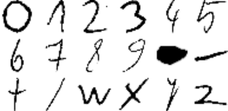

# Basic Handwritten Math Symbols Dataset

## What?
This dataset contains 27000 images of 18 handwritten mathematical symbols (1500 images per symbol). The symbols are: `0,1,2,3,4,5,6,7,8,9,*,-,+,/,w,x,y,z`.

You can find the symbols in the `symbols` directory. Each file has the following format: `<symbol-name>-<id>.png`, e.g. `slash-1484.png`.

## Why?
The data was initially gathered for use in the [camculator](https://github.com/wblachowski/camculator) project. We couldn't find a dataset that would suit our needs, which were digits (MNIST covers this case), some letters (Extended MNIST is fine) and symbols like `/` and `+` (we couldn't find any dataset of high quality and quantity for this case).

## How?
It was gathered by having a couple of people (hence the writing style is not very diverse - sorry about that!) fill numerous sheets of paper with handwritten symbols. We later took the photos of the sheets and put the pictures in a simple processing pipeline which extracted digits automagically, cropping them and scaling to the desired resolution. We later filtered out any trash outputs.

## May I?
Feel free to use this dataset, it's licensed under the MIT License.
